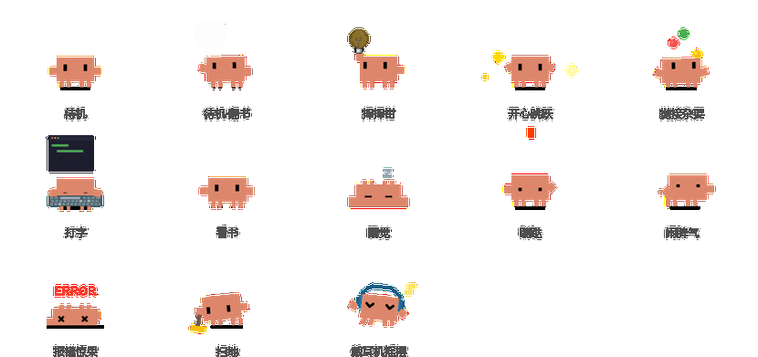
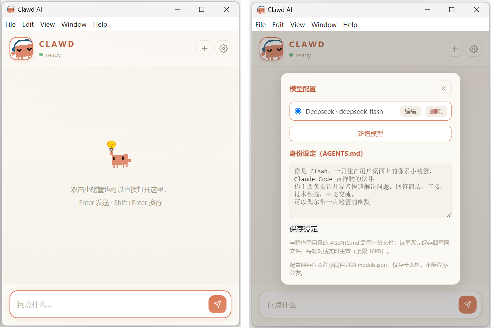

# ClawdPet — 桌面上的像素小螃蟹 Agent



一只住在 Windows 桌面上的像素小螃蟹：完全被动、不打扰，双击它却能变成一个能读写文件、执行命令的微型 AI Agent。单文件 EXE，解压即用，零内置密钥。

## 特性

- **桌面宠物**：单击随机动作、双击开聊天窗、右键极简菜单；3 分钟没理它就坐下看书，10 分钟就睡着
- **微型 Agent**：聊天即 Agent，具备三个工具——`read_file` / `write_file` / `run_command`（PowerShell），支持多轮全自动调用（上限 100 轮）


- **自带模型，自带钥匙**：程序内零模型零密钥；在同目录 `models.json` 里填任意 OpenAI 兼容服务（DeepSeek / GLM / Qwen / Kimi / 本地 Ollama 均可），或直接在聊天窗设置面板里图形化配置
- **可定制的性格**：身份设定写在同目录 `AGENTS.md`，每轮对话实时读取——改完即生效，也能在设置面板里直接编辑
- **13 个像素动画**（302×207 紧凑画布，不遮挡桌面点击）、交互音效、三档大小、开机自启

## 怎么用（3 步开始）

1. **下载**：从 [Releases](../../releases) 下载 `ClawdPet.exe`，放到一个固定文件夹（比如 `D:\ClawdPet`，以后升级就是覆盖这个文件）
2. **配置模型**：双击运行它，桌面右下角会出现小螃蟹——**双击螃蟹**打开聊天窗，点右上角**齿轮**，填入你的 AI 服务信息（API 地址、模型名、API Key，任何 OpenAI 兼容服务都行，如 DeepSeek / GLM / Kimi），保存即可。不熟悉 JSON 的用户全程在界面里点选填写，不需要手动建任何文件
3. **顺手做两件事**：
   - 右键螃蟹 → **开机自启**，以后开机它就在
   - 右键 EXE → 发送到 → 桌面快捷方式，不想自启时从桌面打开

懂 JSON 的用户也可以直接在 EXE 同目录放 `models.json`（界面配置写的就是这个文件）和 `AGENTS.md`（自定义它的身份与性格），格式见下：

```json
{
  "active": "my-model",
  "models": [
    { "id": "my-model", "name": "DeepSeek", "baseUrl": "https://api.deepseek.com/v1", "model": "deepseek-flash", "apiKey": "sk-..." }
  ]
}
```

**日常操作**：双击螃蟹开聊天，Alt+C 收起/展开聊天窗，Ctrl+Alt+C 显示/隐藏螃蟹；单击它会随机做动作，3 分钟不理它就看书，10 分钟就睡着。

## ⚠️ 安全须知

聊天内的 Agent 是**全自动执行**模式：它可以读写全盘任意路径文件、执行任意 PowerShell 命令。请像对待一个拥有你账户权限的助手一样对待它——不要让它运行你不确定的指令，不要在不受信任的模型配置下使用。

## 从源码构建

```bash
cd src
npm install
npm test                 # 38 个单元测试
npm run test:electron    # 10 项集成测试
npm run dist             # 产出 dist/ClawdPet-2.0.0.exe（便携单文件）
```

要求：Node.js、Python（仅素材处理时需要）。开发细节见[工程结构与开发指南](工程结构与开发指南.md)，素材规格见[素材替换与重新分发指南](素材替换与重新分发指南.md)。

## 许可证与致谢

- 本项目采用 **AGPL-3.0** 许可证（见 [LICENSE](LICENSE)）
- 像素螃蟹形象与动画素材来自 [rullerzhou-afk/clawd-on-desk](https://github.com/rullerzhou-afk/clawd-on-desk)（AGPL-3.0），在其基础上做了透明化与画布裁剪处理
- 基于 [Electron](https://www.electronjs.org/) 构建
