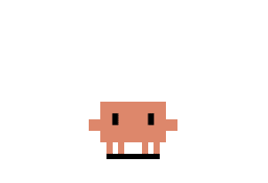

# ClawdPet — 桌面上的像素小螃蟹 Agent



一只住在 Windows 桌面上的像素小螃蟹：完全被动、不打扰，双击它却能变成一个能读写文件、执行命令的微型 AI Agent。单文件 EXE，解压即用，零内置密钥。

## 特性

- **桌面宠物**：单击随机动作、双击开聊天窗、右键极简菜单；3 分钟没理它就坐下看书，10 分钟就睡着
- **微型 Agent**：聊天即 Agent，具备三个工具——`read_file` / `write_file` / `run_command`（PowerShell），支持多轮全自动调用（上限 100 轮）
- **自带模型，自带钥匙**：程序内零模型零密钥；在同目录 `models.json` 里填任意 OpenAI 兼容服务（DeepSeek / GLM / Qwen / Kimi / 本地 Ollama 均可），或直接在聊天窗设置面板里图形化配置
- **可定制的性格**：身份设定写在同目录 `AGENTS.md`，每轮对话实时读取——改完即生效，也能在设置面板里直接编辑
- **13 个像素动画**（302×207 紧凑画布，不遮挡桌面点击）、交互音效、三档大小、开机自启

## 快速开始

1. 从 [Releases](../../releases) 下载 `ClawdPet.exe`，放进任意文件夹
2. 在 EXE 同目录创建 `models.json`（或在首次打开聊天窗的设置面板里配置）：

```json
{
  "active": "my-model",
  "models": [
    {
      "id": "my-model",
      "name": "DeepSeek",
      "baseUrl": "https://api.deepseek.com/v1",
      "model": "deepseek-flash",
      "apiKey": "sk-..."
    }
  ]
}
```

3. （可选）创建 `AGENTS.md` 定义它的身份与性格
4. 双击运行。双击螃蟹开聊天，Alt+C 切换聊天窗，Ctrl+Alt+C 显隐宠物

## ⚠️ 安全须知

聊天内的 Agent 是**全自动执行**模式：它可以读写全盘任意路径文件、执行任意 PowerShell 命令。请像对待一个拥有你账户权限的助手一样对待它——不要让它运行你不确定的指令，不要在不受信任的模型配置下使用。

## 从源码构建

```bash
cd src
npm install
npm test                 # 38 个单元测试
npm run test:electron    # 10 项集成测试
npm run dist             # 产出 dist/ClawdPet-2.0.0.exe（便携单文件）
```

要求：Node.js、Python（仅素材处理时需要）。开发细节见[工程结构与开发指南](工程结构与开发指南.md)，素材规格见[素材替换与重新分发指南](素材替换与重新分发指南.md)。

## 许可证与致谢

- 本项目采用 **AGPL-3.0** 许可证（见 [LICENSE](LICENSE)）
- 像素螃蟹形象与动画素材来自 [rullerzhou-afk/clawd-on-desk](https://github.com/rullerzhou-afk/clawd-on-desk)（AGPL-3.0），在其基础上做了透明化与画布裁剪处理
- 基于 [Electron](https://www.electronjs.org/) 构建
